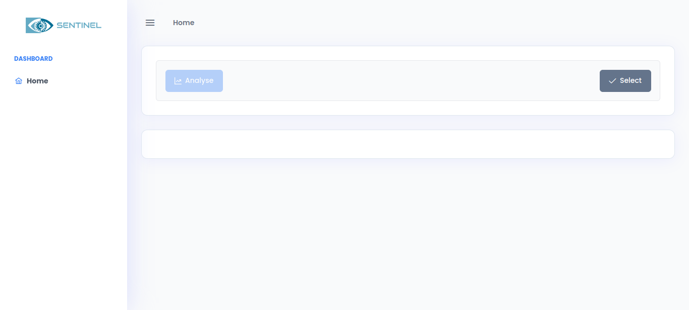
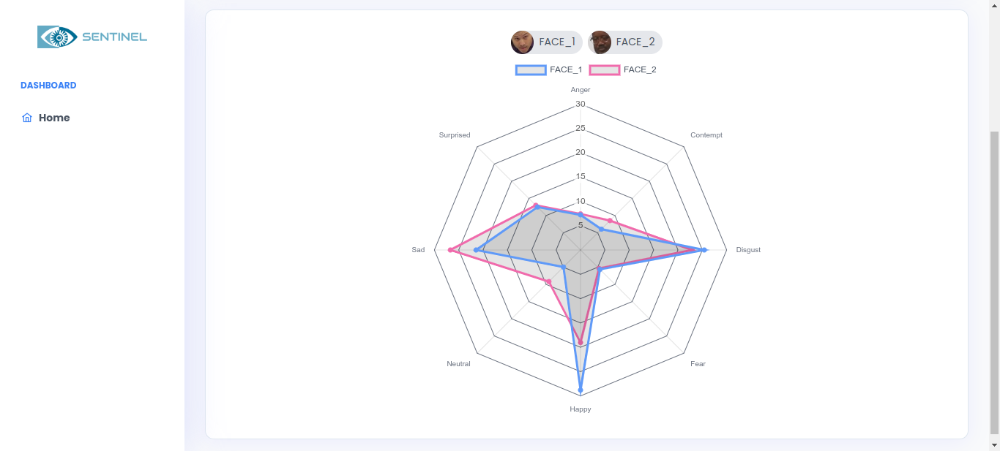

# SENTINEL

## Requirements

This project requires the following software and libraries to be installed:

- Apache Spark: [Installation Guide](https://spark.apache.org/downloads.html)
- Hadoop: [Installation Guide](https://hadoop.apache.org/docs/stable/hadoop-project-dist/hadoop-common/SingleCluster.html)
- npm (Node Package Manager): [Installation Guide](https://www.npmjs.com/get-npm)
- Angular: [Installation Guide](https://angular.io/guide/setup-local)
- Flask: [Installation Guide](https://flask.palletsprojects.com/en/2.1.x/installation/)

## Install Libraries

To install the necessary Python libraries, you can use pip:

```bash
pip install keras tensorflow numpy face_recognition opencv-python scikit-learn
```

Make sure you have appropriate permissions to install packages globally or consider using a virtual environment.

## Running the Application

### Frontend (Angular)

Navigate to the frontend directory and run the following command to start the Angular development server:

```bash
cd frontend
ng serve
```

The frontend will be accessible at `http://localhost:4200`.

### Backend (Flask with Spark)

Make sure you have Apache Spark installed and set up correctly.

Navigate to the backend directory and submit the Flask application using spark-submit:

```bash
cd backend
spark-submit app.py
```

Adjust any necessary configurations in the `app.py` file to suit your Spark setup.

The backend Flask application will be accessible at `http://localhost:5000`.

## User Interface


Here are two screenshots of the user interface:


*SELECT A VIDEO*


*RESULTS*


## Created By

- [ELAALY Hamid](https://github.com/hamidElaaly)
- [AGOURRAME Hamza](https://github.com/Agourrame/)
- [OUCHEN Oussama](https://github.com/OuchenOussama)
